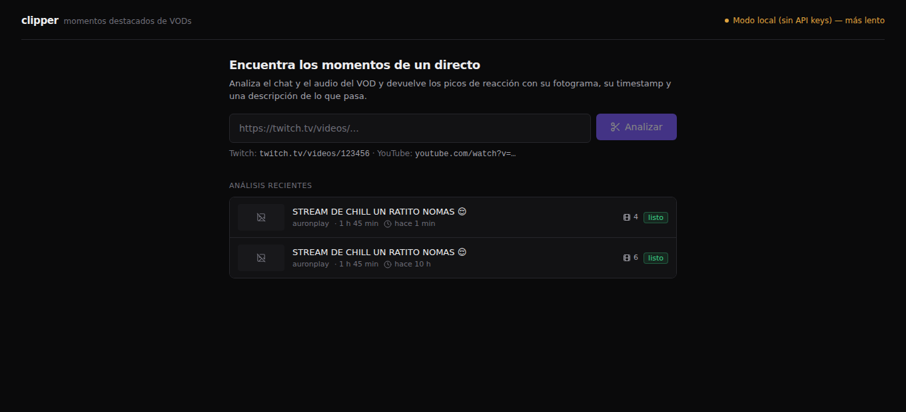
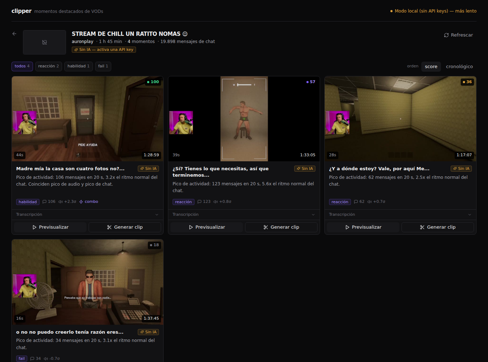

# clipper

Detector automático de momentos destacados en VODs de **Twitch** y **YouTube**.
Pegas un enlace y devuelve una lista de momentos con **descripción, fotograma y timestamp**.

Todo corre en local. **Coste objetivo: 0 €** — funciona sin ninguna API key (modo
degradado local) y mejora si las hay.

```
enlace VOD → ingesta → señales (chat + audio) → candidatos
           → transcripción (solo candidatos) → puntuación LLM
           → fotogramas → UI con lista de momentos
```

> **El render del clip está fuera de alcance.** Cada momento tiene un botón
> «Generar clip» que llama a un endpoint que devuelve `501 Not Implemented` y muestra un
> toast. El tipo `RenderSpec` sí está implementado completo, para que enchufar el render
> después sea trivial.

---

## Instalación

**Requisitos:** Python 3.11+, Node 20+, `ffmpeg` y `ffprobe` en el `PATH`.

```bash
# ffmpeg
sudo apt install ffmpeg        # Debian/Ubuntu
brew install ffmpeg           # macOS

git clone <este-repo> && cd clipper
make setup                    # venv del backend + npm install del frontend
make setup-local              # opcional: faster-whisper para transcribir sin API keys
make dev                      # backend :8000 + frontend :3000
```

Abre <http://localhost:3000> y pega un VOD.

`make setup` copia `backend/.env.example` a `backend/.env`. **No hace falta tocarlo**: sin
ninguna clave la app funciona igual, solo más lenta y con títulos menos ricos.

| Comando | Qué hace |
|---|---|
| `make dev` | Levanta los dos servicios con un solo comando |
| `make backend` / `make frontend` | Solo uno de los dos |
| `make check` | `ruff check` + `tsc --noEmit` |
| `make doctor` | Comprueba ffmpeg/ffprobe y las dependencias |
| `make clean-data` | Borra media, miniaturas y la base de datos |

### Capturas





---

## Modos de funcionamiento

El backend elige proveedor automáticamente y **degrada en lugar de fallar**: un job
siempre termina con resultados.

| | Transcripción | Títulos y puntuación | Aviso en la UI |
|---|---|---|---|
| Sin claves | `faster-whisper` local, o ninguna si no está instalado | heurística sobre las señales | ámbar «Modo local (sin API keys) — más lento» |
| `GROQ_API_KEY` | Groq `whisper-large-v3-turbo` | heurística | — |
| `GEMINI_API_KEY` | local | Gemini `gemini-2.5-flash-lite` | — |
| Las dos | Groq | Gemini | verde «Groq + Gemini» |

Cuando una cuota se agota, el pipeline emite un evento `warning`, cae al proveedor local y
**termina con resultados**. El aviso se ve en la pantalla del job.

Consíguelas gratis en [console.groq.com](https://console.groq.com/keys) y
[aistudio.google.com](https://aistudio.google.com/apikey), y pégalas en `backend/.env`.

---

## Cómo decide qué es un momento

Lo interesante no es detectar «picos», es detectar los picos correctos. Cuatro decisiones
hacen casi todo el trabajo:

**1. z-score local, no umbrales absolutos.** Cada streamer tiene un baseline distinto:
unos están callados, otros tienen un chat que spamea sin parar. Cada señal se normaliza
contra su propia mediana y MAD móviles (ventana de 300 s), que son robustas a picos:

```
z = (x - mediana_movil(x)) / (1.4826 * MAD_movil(x) + suelo)
```

**2. El chat va con retraso.** El pico de chat ocurre entre 3 y 15 s *después* del evento.
Si centras el clip en el pico de chat, lo interesante queda fuera por delante. Las señales
de chat se **adelantan** `CHAT_LAG_S` (8 s por defecto) antes de fusionarlas, y la ventana
es asimétrica: `[t_peak − 25 s, t_peak + 15 s]`.

**3. Bonus de combo (×1.4).** Si en la misma ventana de 10 s coinciden pico de audio y pico
de chat, el score se multiplica. La coincidencia de dos señales independientes es mucho más
predictiva que un pico grande en una sola.

**4. Emotes, no keywords.** `emote_burst` cuenta mensajes que son mayoritariamente emotes o
llevan expresiones de hype. Es **independiente del idioma**: los streamers en
castellano/catalán no escriben «POGGERS», escriben «jajaja», «madre mía» o «quina passada».
La lista está en `backend/app/config.py` y se puede sobrescribir por entorno.

Además: `unique_users` por bin (más robusto frente al spam de un solo usuario),
non-maximum suppression con `MIN_GAP_S = 45`, descarte de los primeros y últimos 60 s
(pantallas de «starting soon») y exclusión de los tramos muteados por copyright del cálculo
del baseline.

### Solo se transcriben los candidatos

30 candidatos × 40 s = **20 minutos** de audio, frente a las 6 horas del VOD. Esta decisión
es la que hace viable el tier gratuito: con los 28.800 segundos de audio diarios de Groq
salen unos 24 VODs de 6 h al día.

Con las palabras alineadas se **refinan los bordes** del corte para que no empiece ni acabe
a media frase: el inicio retrocede al primer arranque de palabra tras el silencio más largo
de `[t_peak−30, t_peak−10]`, y el final avanza hasta el último final de palabra antes del
siguiente silencio de más de 0,6 s. Eso es lo que separa un clip que parece editado de un
recorte aleatorio.

---

## Arquitectura

```
clipper/
├── backend/                    Python 3.11 · FastAPI · SQLite · asyncio
│   ├── app/
│   │   ├── main.py             rutas /api + SSE
│   │   ├── db.py               esquema y migraciones
│   │   ├── config.py           settings desde entorno
│   │   ├── events.py           bus de eventos (persistido, reengancha el SSE)
│   │   ├── pipeline/
│   │   │   ├── orchestrator.py cola in-process y ejecución del job
│   │   │   ├── ingest.py       yt-dlp: metadata, audio, URL de stream
│   │   │   ├── chat.py         Twitch GQL / YouTube live_chat
│   │   │   ├── signals.py      RMS de audio, densidad de chat, z-scores
│   │   │   ├── candidates.py   fusión, picos, NMS
│   │   │   ├── transcribe.py   Groq | faster-whisper local
│   │   │   ├── score.py        Gemini | heurística
│   │   │   └── frames.py       ffmpeg -ss → jpg
│   │   └── providers/
│   │       ├── ratelimit.py    token bucket + cuota diaria persistida
│   │       ├── groq.py, gemini.py, local.py
│   └── data/                   (gitignored) media/, thumbs/, clipper.db
├── frontend/                   Next.js 15 · TypeScript · Tailwind
└── scripts/                    utilidades de verificación
```

**Descarga:** en el modo por defecto (`DOWNLOAD_MODE=stream_seek`) **no se descarga el
vídeo**. Un VOD de 6 h en 720p son ~10 GB; solo se baja el audio (WAV 16 kHz mono, ~690 MB
para 6 h) y los fotogramas se sacan bajo demanda con `ffmpeg -ss <t> -i <url_remota>`.
Poniendo `-ss` **antes** de `-i`, ffmpeg hace seek en el contenedor remoto sin descargarlo.
Si la extracción remota falla dos veces, cae automáticamente a descargar el mp4 a 480p.

---

## API

Prefijo `/api`. CORS abierto a `localhost:3000` (configurable con `CORS_ORIGINS`).
Documentación interactiva en <http://127.0.0.1:8000/docs>.

| Método | Ruta | Descripción |
|---|---|---|
| `POST` | `/jobs` | `{url}` → `{job_id, video}`. Valida el enlace e inicia el pipeline |
| `GET` | `/jobs/{id}` | Estado + `moments[]` si ha terminado |
| `GET` | `/jobs/{id}/events` | **SSE** con progreso en vivo (reenvía el historial) |
| `DELETE` | `/jobs/{id}` | Cancela y limpia ficheros temporales |
| `GET` | `/jobs` | Historial paginado |
| `GET` | `/moments/{id}/thumbnail` | JPEG del fotograma (bajo demanda + caché en disco) |
| `POST` | `/moments/{id}/render` | **STUB → 501** con el `RenderSpec` en el `detail` |
| `GET` | `/health` | Estado de proveedores y cuota restante del día |

Eventos SSE (progreso monótono, un `id:` por evento para poder reengancharse):

```json
{"stage": "ingest",     "progress": 0.15, "message": "Descargando audio (12%)"}
{"stage": "chat",       "progress": 0.30, "message": "18.420 mensajes"}
{"stage": "candidates", "progress": 0.50, "message": "30 candidatos"}
{"stage": "transcribe", "progress": 0.75, "message": "Transcribiendo 14/30 (groq)"}
{"stage": "warning",    "message": "Cuota de groq agotada. Usando Whisper local."}
{"stage": "done",       "progress": 1.0,  "moments": 12}
```

---

## Configuración

Todo en `backend/.env` (ver `backend/.env.example`). Lo más útil:

| Variable | Def. | Para qué |
|---|---|---|
| `DOWNLOAD_MODE` | `stream_seek` | `full` descarga el mp4 a 480p en lugar de hacer seek remoto |
| `MAX_VOD_HOURS` | `8` | Rechaza VODs más largos con un error legible |
| `CHAT_LAG_S` | `8` | Cuánto se adelanta el chat al fusionar |
| `W_CHAT` / `W_USERS` / `W_EMOTE` / `W_AUDIO` | `1.0` / `1.2` / `1.5` / `0.8` | Pesos de la fusión. Sin chat, `W_AUDIO=1` y el resto a 0 |
| `PEAK_PERCENTILE` | `97` | Umbral de picos. Se relaja solo si salen menos de 5 |
| `MIN_GAP_S` | `45` | Separación mínima entre picos (NMS) |
| `MAX_CANDIDATES` / `TOP_N` | `30` / `12` | Candidatos analizados / momentos mostrados |
| `MIN_CLIP_S` / `MAX_CLIP_S` | `12` / `60` | Duración del clip tras refinar bordes |
| `WHISPER_MODEL` | `large-v3-turbo` | `small` o `medium` para máquinas modestas |
| `KEEP_MEDIA` | `0` | `1` conserva el WAV al terminar (útil para reanalizar) |
| `EDGE_TRIM_S` | `60` | Segundos descartados al principio y al final |
| `GROQ_ASD` | `28800` | Segundos de audio/día de Groq. Bájalo para probar la degradación |

---

## Verificación

```bash
make check                                     # ruff check + tsc --noEmit

# Fases 3-5: picos de audio/chat y candidatos de un VOD real
backend/.venv/bin/python scripts/inspect_signals.py https://www.twitch.tv/videos/<id>

# Fase 10: la cuota se agota y el pipeline degrada en lugar de fallar
backend/.venv/bin/python scripts/check_quota_degradation.py
```

Para reproducir el criterio de degradación completo, pon en `backend/.env`:

```bash
GROQ_API_KEY=cualquier-cosa
GROQ_ASD=60
```

y lanza un análisis: verás el evento `warning` («Cuota de groq agotada… Usando Whisper
local») y el job terminará con momentos.

---

## Trampas conocidas

- **El chat replay de Twitch se pagina por `contentOffsetSeconds`, no por cursor.** La
  paginación por cursor dispara el reto de integridad KPSDK en la segunda petición y
  necesitaría un navegador real. Por offset no lo dispara.
- **`ffmpeg -ss` va antes de `-i`.** Al revés decodifica el fichero entero desde el
  principio y tarda minutos en un VOD largo.
- **Las URLs HLS de Twitch caducan** (token de ~24 h). Se guarda `stream_url_expires_at`;
  si un `ffmpeg -ss` devuelve 403 se re-resuelve con `yt-dlp -g` y se reintenta una vez.
- **Twitch mutea tramos con música con copyright.** El audio muteado da RMS ≈ 0 y produce
  falsos negativos: los tramos de silencio absoluto de más de 30 s se excluyen del cálculo
  del baseline.
- **Los VODs de cuentas normales caducan a los 60 días** y sin replay no hay chat. El
  análisis continúa solo con audio y lo avisa en la UI.
- **Raids y donaciones** disparan el chat sin que pase nada: para eso está el
  `worth_clipping` del LLM.
- **No se fuerza el idioma en Whisper.** Los streamers de aquí mezclan castellano y catalán
  en la misma frase; la autodetección funciona mejor.
- **`ffprobe` puede reportar duraciones distintas a las de yt-dlp** en HLS. Se usa siempre
  la de yt-dlp como referencia para los offsets del chat.
- **YouTube puede pedir verificación anti-bot** desde IPs de datacenter. En una máquina
  normal no pasa; si pasa, yt-dlp acepta `--cookies-from-browser`.

---

## Notas legales

Descargar VODs **no encaja con los Términos de Servicio de Twitch**. El contenido pertenece
al streamer. Los VODs suelen incluir música con copyright que hará que el clip resultante
sea retirado en TikTok o YouTube.

Esta herramienta es para **uso personal o con permiso explícito del creador**.

El endpoint GraphQL de Twitch que se usa para el chat replay es **privado y no
documentado**: puede dejar de funcionar sin previo aviso.
